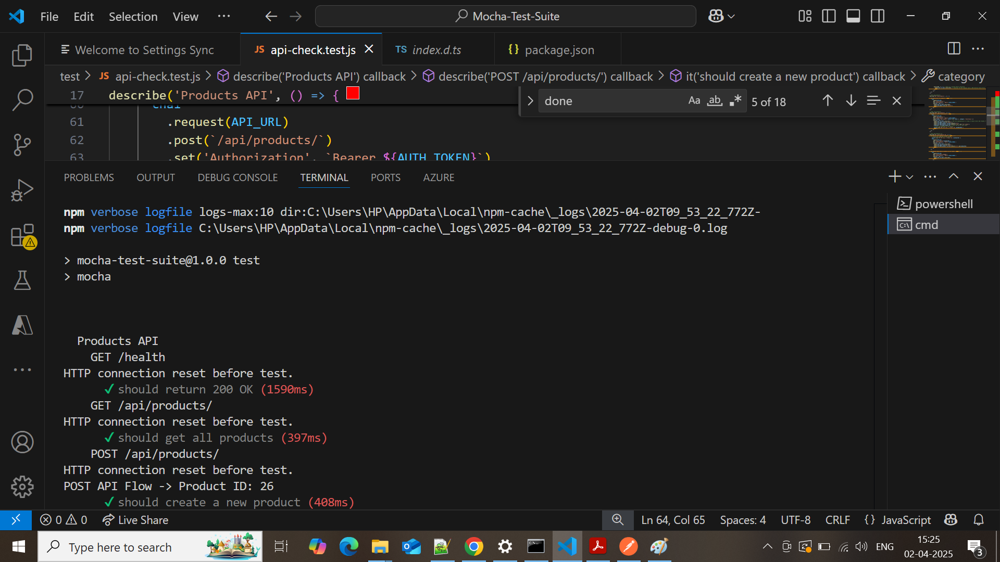
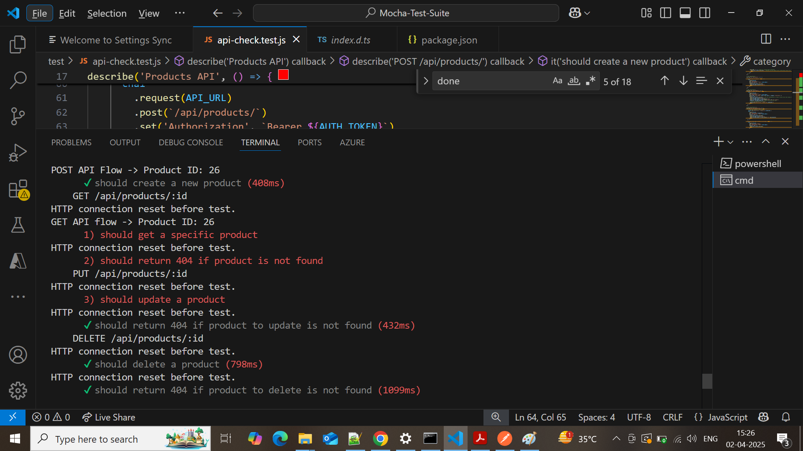
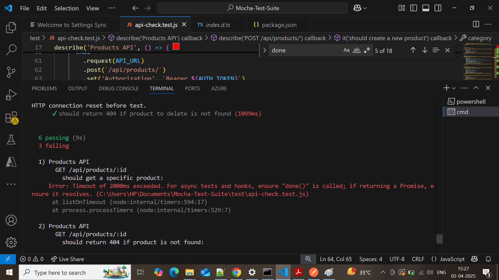
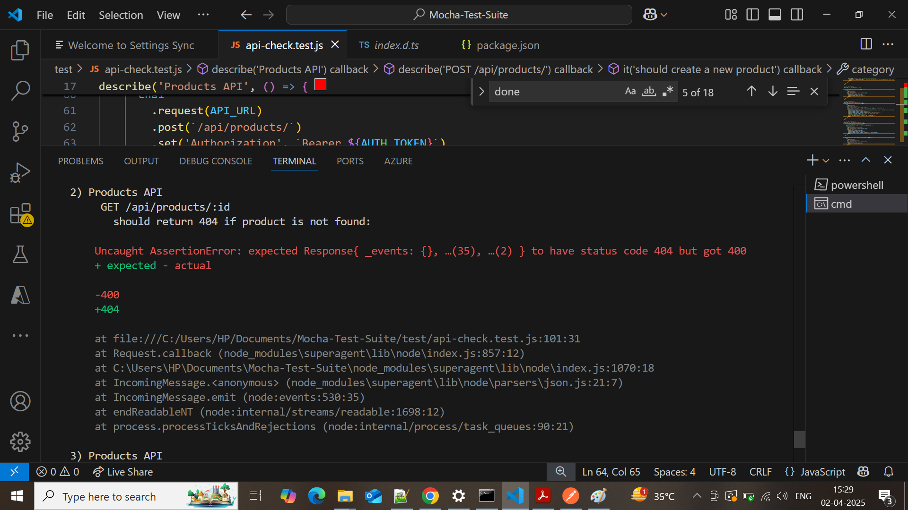
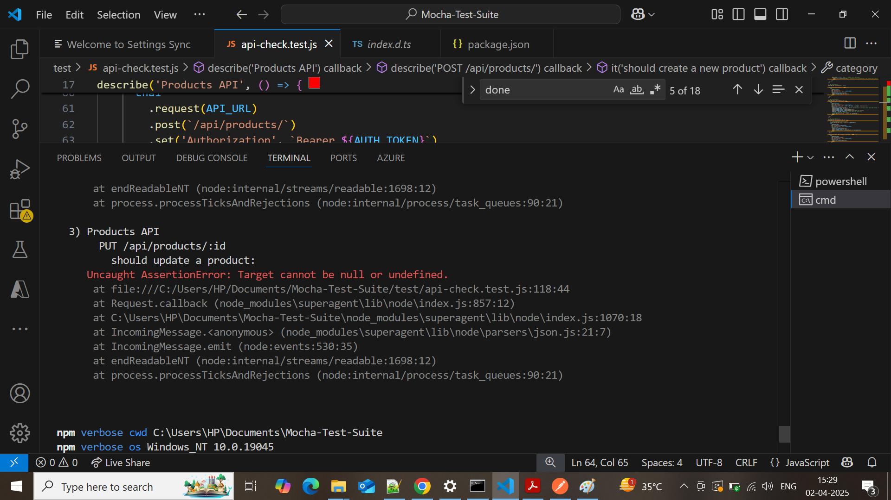

# Products API Test Suite

This project contains various test cases in the Test Suite for the **Products API**. It uses **Mocha** Framework and **Chai** library along with the **Chai-HTTP** plugin to perform API testing. All the tests are designed to interact with the APIs and verify the CRUD (Create, Read, Update, Delete) operations for products.

## API Endpoints Tested

- **GET /health** - Health check to ensure the API health status
- **GET /api/products/** - Fetches all products.
- **POST /api/products/** - Creates a new product.
- **GET /api/products/:id** - Fetches a product by its ID.
- **PUT /api/products/:id** - Updates a product by its ID.
- **DELETE /api/products/:id** - Deletes a product by its ID.

## Installation

1. Clone the repository:

   ```bash
   git clone https://github.com/yourusername/products-api-test.git
   cd products-api-test
   npm install
   npm test


## Screenshots of the Test Cases Execution

Part-1


Part-2

    
Part-3


Part-4


Part-5
